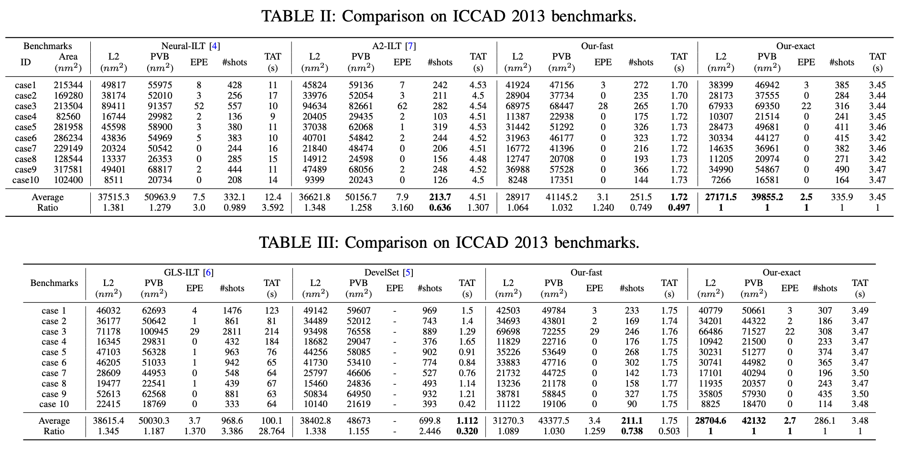
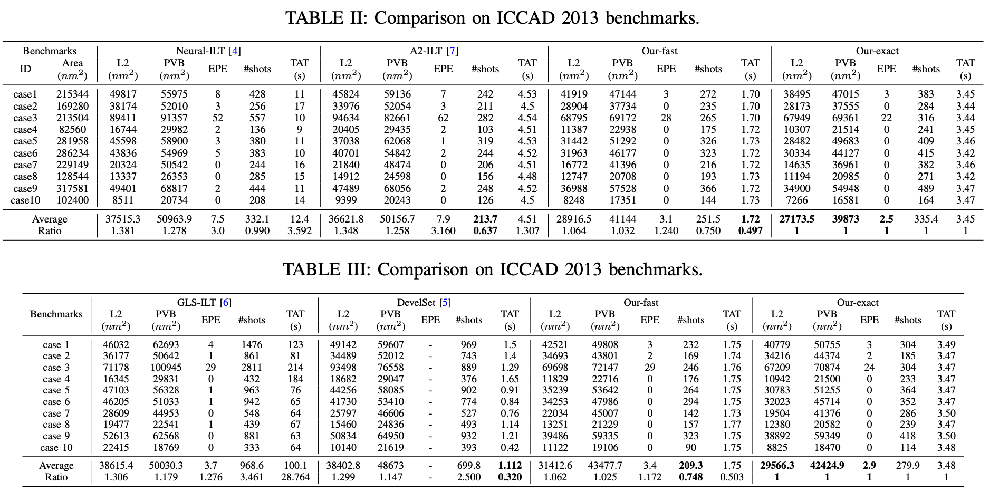

img/center_test is following the setting of ''Neural-ILT''

Thanks a lot for neural-ilt's author ^_^

Today, I find some shapes are out of the bounding box for the center_test, here is a corrected result. We will put the corrected result on arxiv and release code later.

camera-ready version

corrected version

