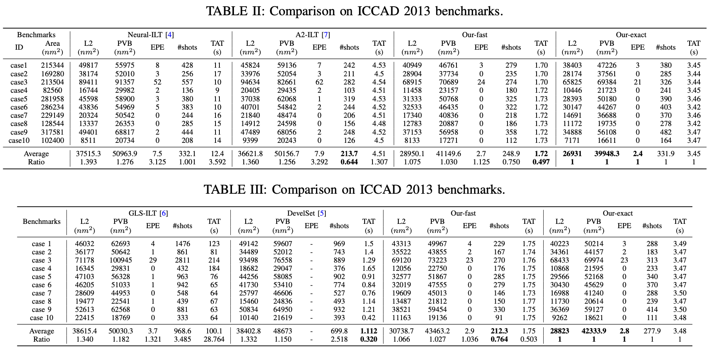

# Multi-level ILT

## Overview

This repository is the official implementation for the paper: 

## (Update 2023.07.16) Rectified results and source released

We found that certain shapes in the final mask solution exceeded the designated optimization area by a small margin. To address this issue, we 
made necessary adjustments and have now provideed the updated results below.

## Quick start

Multiple ILT methods have been subjected to testing and verification using the [ICCAD 2013 mask optimization contest benchmarks](https://ieeexplore.ieee.org/document/6691131). However, it is worth noting that discrepancies exist among the datasets employed in these evaluations. To ensure a comprehensive and equitable comparison with these methods, we present two distinct versions of the dataset. The first version (./dataset/neural_test) corresponds to the dataset utilized by [Neural-ILT](https://ieeexplore.ieee.org/document/9256592) and [A2-ILT](https://dl.acm.org/doi/abs/10.1145/3489517.3530579), while the second version (./dataset/develset_test) aligns with the dataset employed by [DevelSet](https://ieeexplore.ieee.org/document/9643464) and [GLS-ILT](https://ieeexplore.ieee.org/document/9474212).

The test scripts are saved in ./scripts.
~~~bash
$ source scripts/neural_fast_test.sh
~~~

## Acknowledgement
Thanks to everyone who makes their code or data available:

- [Neural-ILT](https://github.com/cuhk-eda/neural-ilt)
